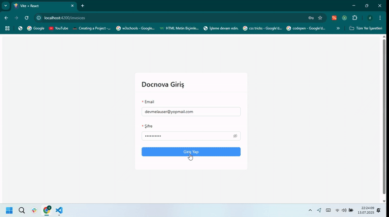

# 📄 Docnova Frontend Task

Bu proje, Docnova için verilen Frontend Developer Task kapsamında hazırlanmıştır. Projede React.js, Redux Toolkit ve Ant Design teknolojileri kullanılmıştır.

---

## 🚀 Kurulum ve Çalıştırma Adımları

### 1️⃣ Projeyi Klonlayın

git clone https://github.com/kullanici-adi/proje-adi.git
cd proje-adi

npm install

VITE_API_BASE_URL=https://api-dev.docnova.ai

npm run dev

src/
├── app/                 # Redux store
├── features/            # Slice dosyaları (auth, invoices)
├── pages/               # Sayfalar (Login, Invoices, InvoiceDetail)
├── components/          # Ortak bileşenler
├── i18n/                # (İsteğe bağlı) Çoklu dil desteği
├── App.jsx              # Route'lar ve uygulama iskeleti
└── main.jsx             # Başlangıç dosyası

